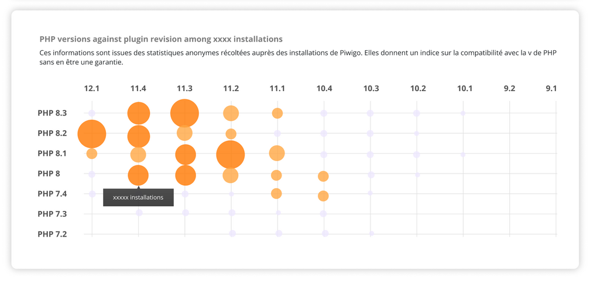

# Exercice 1 — Piwigo

Implémentation de cette maquette d’un Bubble Matrix Chart en HTML / CSS / JavaScript.



---

## Arborescence du projet


```
exercice1_piwigo
├── images
├── js
│   ├── componentes
│   │   └── grid.js
│   └── functions
│       ├── api.js
│       └── createElement.js
├── index.html
├── style.css
└── script.js
```

---

## Important

Dans le fichier api.js, les appels fetch vers les API sont actuellement commentés.

Ils ont été remplacés par des tableaux contenant des versions hardcodées afin d’éviter les erreurs lors du premier démarrage du projet.

Pour activer le fonctionnement normal :

- Décommentez les appels fetch  
- Commentez les 2 tableaux

Le script pourra alors récupérer correctement les données depuis les API.